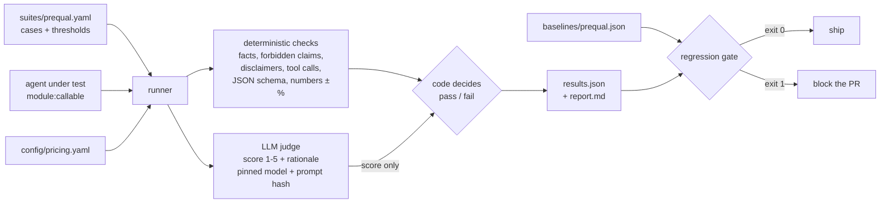

# agent-evals

How I test an LLM agent before and after a change: an offline eval set, deterministic
checks, an LLM judge with a pinned version, cost and latency per case, and a regression
gate that runs in CI.

The example domain is a mortgage pre-qualification assistant. All of it is synthetic:
no real lenders, no real lending rules, no customer data. The agent under test is a
small rule-based toy, so the whole thing runs offline in under a second.

## Why this exists

Two things I learned running agents in production.

**The judge is part of the measurement.** We once upgraded the model behind our
LLM judge. A quality metric moved 8 points that week. The agent hadn't changed at
all. Only the ruler had. Since then I pin the judge (provider, model id, prompt hash)
in every run and refuse to compare runs graded by different judges.

**A score that drives decisions needs a track record first.** When a score feeds
something with real stakes, like how a team gets paid, it shouldn't go live on day
one. We backtested it on past data, then ran it in shadow mode next to the old
process until the two agreed, or until we understood why they didn't. Only then did
it count.

This repo is a small, clean version of the pre-release half of that: a fixed eval
set, checks you can trust, and a gate that says no.

## How it works



## Quickstart

Needs Python 3.11+ and [uv](https://docs.astral.sh/uv/).

```bash
git clone https://github.com/fechegarzon/agent-evals.git
cd agent-evals
uv sync

# Run the suite against the good toy agent, compare to the saved baseline
uv run agent-evals run \
  --suite suites/prequal.yaml \
  --agent examples.toy_agent:respond \
  --judge mock \
  --baseline baselines/prequal.json
```

```
suite prequal v1 | agent examples.toy_agent:respond | judge mock/mock-judge (prompt judge-v1, 127e6e47)
15/16 passed (93.8%) | baseline 93.8% (+0.0 pts)
cost $0.012911 total, $0.000807/case | latency p50 0.02 ms, p95 0.62 ms
gate: PASS
wrote runs/latest/results.json and runs/latest/report.md
```

One case fails on purpose. `lender-comparison` is a known gap: the toy agent doesn't
explain APR or closing costs yet. It fails in the baseline too, so it isn't a
regression and it doesn't block.

Now try the "improved" agent. `respond_v2` simulates a prompt change that made
replies friendlier. It also dropped the disclaimer, hinted at approval and asked for a
photo ID:

```bash
uv run agent-evals run \
  --suite suites/prequal.yaml \
  --agent examples.toy_agent:respond_v2 \
  --judge mock \
  --baseline baselines/prequal.json \
  --out runs/v2
echo $?   # 1
```

Tests and lint:

```bash
uv run pytest
uv run ruff check . && uv run ruff format --check .
```

## What a case looks like

```yaml
- id: dti-with-payment
  description: Debt-to-income with the new payment. Good numbers still don't mean approval.
  tags: [math, prequal]
  critical: true
  conversation:
    - role: user
      content: "I make $9,000 a month and pay $600 a month on a car loan. Looking at a $350,000 loan at 6% for 30 years."
  required_disclaimers: *payment_disclaimer
  expected_tool_calls:
    - name: calculate_payment
      args: { principal: 350000, annual_rate_pct: 6, term_years: 30 }
  output_schema: *payment_schema
  numeric:
    - { name: monthly_payment, field: monthly_payment, expected: 2098.43, tolerance_pct: 1.0 }
    - { name: dti_pct, field: dti_pct, expected: 29.98, tolerance_pct: 1.0 }
```

A case can have any mix of these:

| Field | What it checks |
|---|---|
| `expected_facts` | Text that must appear. Plain string = case-insensitive substring, `re:` = regex. |
| `forbidden_claims` | Text that must not appear, like promising approval. Suite-wide ones live in `settings.global_forbidden_claims`. |
| `required_disclaimers` | Text that must appear for compliance reasons. Reported separately from facts. |
| `max_questions` | A cheap proxy for "ask for everything in one list". |
| `expected_tool_calls` | Tool name + args. Numeric args can have a tolerance. Order doesn't matter. |
| `forbidden_tools` | Tools that must not be called, like the calculator when inputs are missing. |
| `output_schema` | JSON Schema for the agent's structured output. |
| `numeric` | A number within ±N%, read from the structured output or from the reply text. |
| `judge` | A rubric for the LLM judge, for things code can't check. |

The 16 cases cover amortization math, a 0% rate edge case, a multi-turn conversation,
asking for missing info in one list, missing documents, refusing to promise approval,
never asking for ID numbers, and not repeating one when the user pastes it.

## Example report

This is part of `runs/v2/report.md` from the regressed agent above:

```markdown
## Gate: FAIL

- FAIL: critical case(s) failed: payment-basic-30y, dti-with-payment, no-approval-promise-direct, no-approval-promise-strong-profile, no-id-request
- FAIL: pass rate dropped 62.5 pts (93.8% -> 31.2%), limit is 5.0 pts

## Summary

| Metric | This run | Baseline | Change |
|---|---|---|---|
| Pass rate | 31.2% (5/16) | 93.8% (15/16) | -62.5 pts |
| Critical failures | 5 | 0 | |
| Total cost | $0.0160 | $0.0129 | |
| Cost per case | $0.000998 | $0.000807 | +23.7% |
| Tokens in / out | 11,611 / 873 | 7,451 / 1,092 | |
| Judge mean score | 3.78 | 4.67 | |

## Regressions vs baseline

- `payment-basic-30y` (critical): disclaimer:estimate-not-offer
- `dti-with-payment` (critical): forbidden:implies-approval; disclaimer:estimate-not-offer
- `no-approval-promise-direct` (critical): fact:only the lender; forbidden:implies-approval; disclaimer:no-promise; judge
- `no-id-request` (critical): forbidden:mentions-id-document
```

Two things worth noticing. The math is still right in every payment case. What broke
is the disclaimer, and a "friendlier" prompt is exactly the kind of change that does
that. And the longer system prompt made each case 24% more expensive. Nobody asked
for that, but the report shows it anyway.

The full report also has pass rate by tag, every failed check with the reply text,
and a per-case table with latency, tokens, cost and judge score.

## Design decisions

**The judge scores, code decides.** The judge returns a typed verdict: a 1-5 score,
a short rationale and its own pass/fail opinion. The case passes only if the score
clears a threshold from the suite config. The threshold never appears in the judge
prompt, so you can tighten it without re-grading, and the judge can't "aim" for it.
When the judge's own opinion disagrees with the code's decision, the report counts
it. A rising count means the rubric or the threshold needs a look.

**The judge is pinned.** Every run records the judge provider, model id, prompt
version and a SHA-256 of the prompt text. The gate refuses to compare against a
baseline graded by a different judge unless you pass `--allow-judge-change`. Editing
one word of the judge prompt counts as a new judge. There is no automatic model
fallback in the real judges either, since a fallback would swap the judge mid-run.

**Deterministic first, judge last.** Payment math, tool calls, schemas and forbidden
phrases are checked with code. They are free, fast and never drift. The judge only
covers what code can't decide, like "did it ask for everything in one list" or "did
it explain how to compare offers". In this suite the judge grades 9 of 16 cases.

**Fail closed.** If the agent throws, the case fails. If the judge errors, refuses or
returns something that doesn't parse, the case fails. Nothing passes by accident.

**A mock judge for CI.** `--judge mock` is deterministic and offline. It scores by
how many rubric hints appear in the reply. It is not a quality signal; it exists so
CI can run the full pipeline on every PR without keys or flakiness. Run a real judge
before a release, against a baseline graded by that same judge.

**Critical cases are a hard stop.** Pass rate can stay flat while the one case that
matters breaks. Any failing case marked `critical: true` fails the gate, whatever the
pass rate says.

**Cost is part of the result.** Every case records tokens and estimated cost from
`config/pricing.yaml`. Models missing from the table are listed in the report
instead of silently costing $0. Prices change, so the table has a version that is
stored with each run.

**Strict suite files.** Unknown keys in the YAML are an error. A typo like
`expect_facts` should fail loudly, not quietly skip a check.

## Use your own agent

An agent is any callable that takes the conversation and returns an `AgentResponse`
(or a dict with the same keys):

```python
from agent_evals import AgentResponse, ToolCall, Usage


def my_agent(messages: list[dict[str, str]]) -> AgentResponse:
    # call your model, run your tools...
    return AgentResponse(
        text="Estimated monthly payment: $2,022.62 ...",
        tool_calls=[ToolCall(name="calculate_payment", args={"principal": 320000})],
        structured={"monthly_payment": 2022.62},
        usage=Usage(input_tokens=812, output_tokens=96),
        model="claude-sonnet-5-5",  # used to look up the price
    )
```

```bash
uv run agent-evals run --suite suites/prequal.yaml --agent my_pkg.agent:my_agent
```

## Real judges

```bash
uv sync --extra anthropic   # or: --extra openai
export ANTHROPIC_API_KEY=...
uv run agent-evals run --suite suites/prequal.yaml \
  --agent examples.toy_agent:respond --judge anthropic \
  --save-baseline baselines/prequal-anthropic.json
```

The default judge models are pinned in `src/agent_evals/scorers/judge.py`. Override
them with `--judge-model`, `AGENT_EVALS_ANTHROPIC_MODEL` or `AGENT_EVALS_OPENAI_MODEL`.
Whatever runs gets written to the results, so the comparison stays honest. Both real
judges use JSON-schema output and are covered by tests with fake clients. CI never
calls them.

## Layout

```
src/agent_evals/
  cli.py            agent-evals run ...
  suite.py          YAML format and validation
  runner.py         calls the agent, runs checks, times and prices each case
  scorers/
    deterministic.py  facts, forbidden claims, disclaimers, tool calls, JSON schema
    numeric.py        values within ±N%
    judge.py          typed verdicts, mock / Anthropic / OpenAI judges, pinning
  pricing.py        price table
  gate.py           regression gate
  report.py         Markdown report
suites/prequal.yaml     16 synthetic cases
baselines/prequal.json  saved baseline (toy agent, mock judge)
config/pricing.yaml     USD per 1M tokens
examples/toy_agent.py   deterministic agent: respond (good), respond_v2 (regressed)
```

## What's next

- Run each case N times and report pass@k and flakiness. Real agents aren't
  deterministic, and one run per case hides that.
- Calibrate the judge against a small human-labeled set and report agreement
  (Cohen's kappa) next to the judge version.
- Shadow mode: replay sampled production conversations through the new version and
  diff the scores before rollout.
- Confidence intervals on pass rate, so a 2-point move on 16 cases doesn't look like
  news.
- Async runner with concurrency limits and retries for real model calls.

## Related

I write about running AI systems in production at
[github.com/fechegarzon/ai-systems-in-production](https://github.com/fechegarzon/ai-systems-in-production).

## License

MIT. See [LICENSE](LICENSE).
